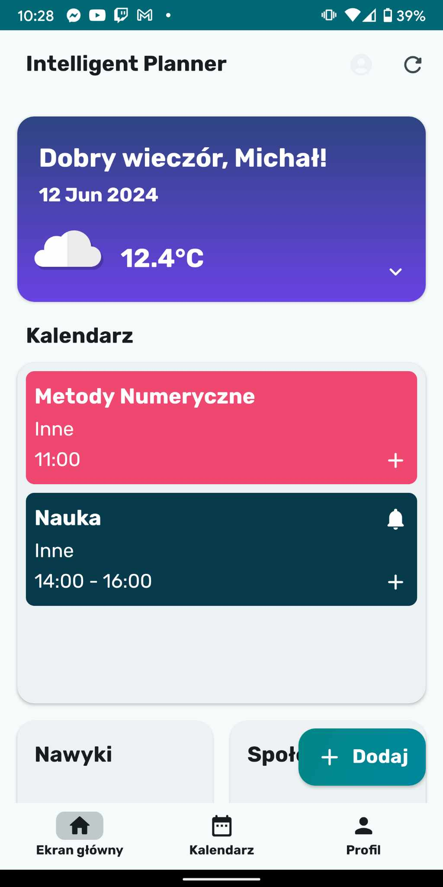
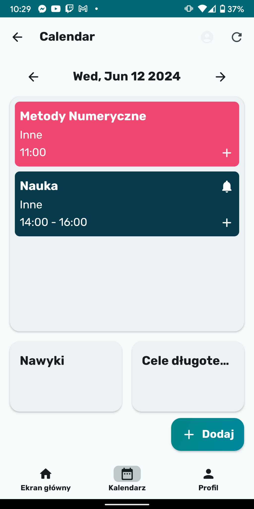
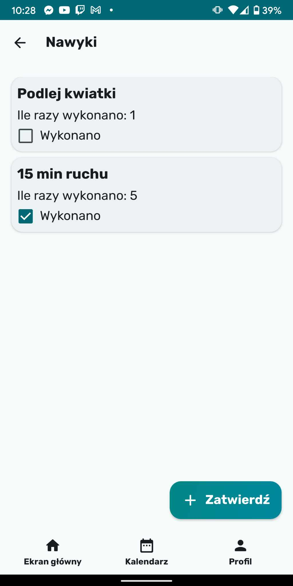
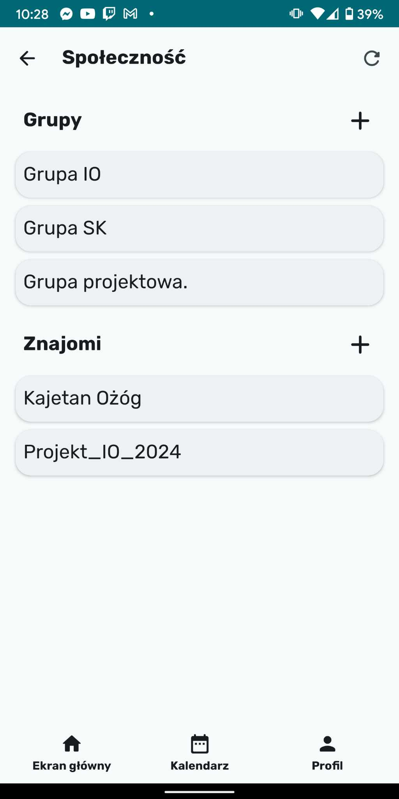
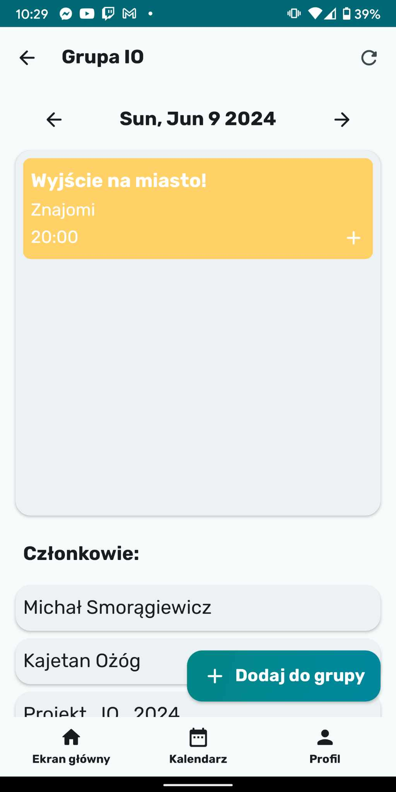
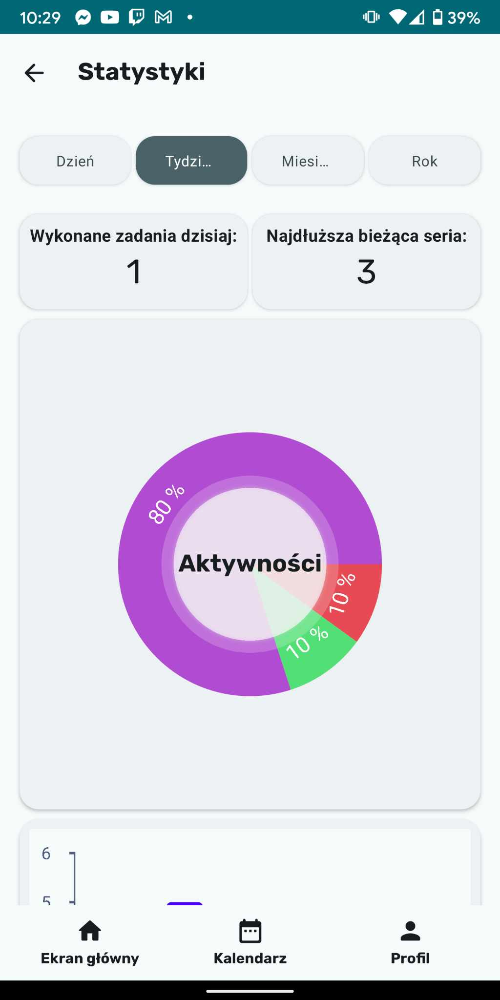

 
# Inteligentny Planer
## Autorzy: Michał Smorągiewicz, Kajetan Ożóg, Bartosz Siwakowski, Michał Kopyłowski, Bartosz Bugajski   

### Opis aplikacji:
Aplikacja Inteligentny Planer to zaawansowane narzędzie do zarządzania czasem, które integruje funkcje planowania kalendarza, monitorowania pogody oraz możliwości współpracy społecznościowej. Użytkownicy będą mogli łatwo dodawać zadania, cele długoterminowe, tworzyć grupy z przyjaciółmi, przeglądać zaplanowane aktywności znajomych, a także organizować i zarządzać wspólnymi wydarzeniami. Dzięki funkcjom asystenta aplikacja będzie dostarczać spersonalizowane sugestie, pomagając użytkownikom w optymalnym planowaniu swojego dnia. Aplikacja stawia nacisk na dodawanie aktywności grupowych i dzielenie się tymi aktywnościami z innymi użytkownikami. 

## Poniżej znajdują się wybrane zrzuty ekranu aplikacji

## Wymagania 
- Telefon z systemem Android w wersji 8.0 (SDK 26) lub nowszej w języku polskim lub angielskim
- Dostępu do Internetu dla synchronizacji danych, pobierania prognozy pogody i konta Google do logowania, a także usług lokalizacyjnych

### Aby zainstalować naszą aplikację na telefonie wystarczy pobrać plik [intelligent_planner_v1.0.apk ](https://github.com/michalgs/IO_Project/blob/master/intelligent_planner_v1.0.apk)

### W razie jakichkolwiech błedów w czasie funkcjonowania aplikacji prosimy o kontatk mailowy pod adresem e-mail projektio2024@gmail.com 

